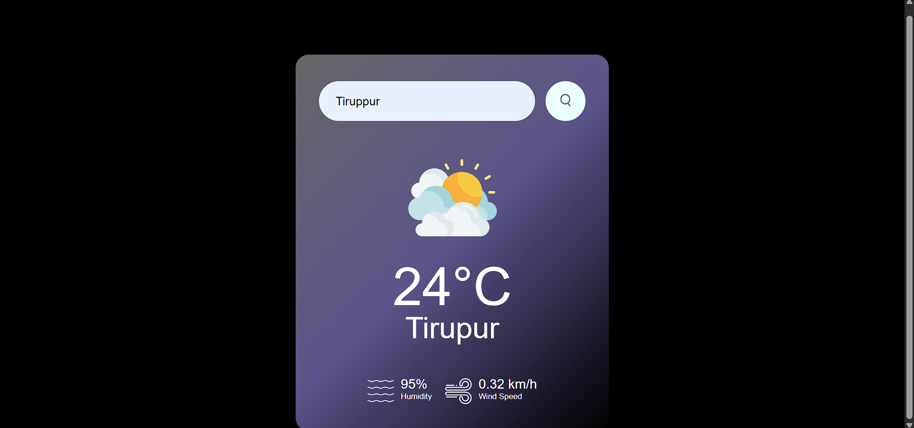

# Weather App 🌤️

A modern, responsive weather application that provides real-time weather information with a beautiful user interface.

## Screenshot 📸



## Features ✨

- Real-time weather data
- Search by city name
- Responsive design for all devices
- Beautiful glassmorphism UI
- Loading animations
- Display of:
  - Temperature
  - Humidity
  - Wind Speed
  - Weather Conditions
  - Weather Icons

## Technologies Used 🛠️

- HTML5
- CSS3
- JavaScript
- Weather API
- Responsive Design
- CSS Animations
- Glassmorphism Effects

## Live Demo 🌐

[Check it out here!](#) <!-- Add your live demo link -->

## Installation & Setup 🚀

1. Clone the repository:

   ```bash
   git clone https://github.com/jeyasurya23/weather-app.git
   ```

2. Navigate to the project directory:

   ```bash
   cd weather-app
   ```

3. Open `index.html` in your browser.

## API Key Setup 🔑

1. Sign up at [Weather API Provider](https://openweathermap.org/) (or your preferred provider).
2. Get your API key.
3. Add your API key to the code:

   In `script.js`:
   ```javascript
   const apiKey = 'YOUR_API_KEY';
   ```

## Project Structure 📁

```
weather-app/
│
├── index.html
├── style.css
├── script.js
├── images/
│   ├── weather-icons/
└── README.md
```

## Features in Detail 📝

### Weather Information
- Current Temperature
- City Name
- Weather Condition
- Humidity Percentage
- Wind Speed
- Weather Icon

### UI Components
- Search Bar
- Weather Display Card
- Loading Animation
- Error Messages

## Responsive Design 📱

The app is fully responsive and works on:
- Desktop 🖥️
- Tablet 📱
- Mobile Phones 📱

## Contributing 🤝

1. Fork the project.
2. Create your feature branch (`git checkout -b feature/AmazingFeature`).
3. Commit your changes (`git commit -m 'Add some AmazingFeature'`).
4. Push to the branch (`git push origin feature/AmazingFeature`).
5. Open a Pull Request.

## License 📄

This project is licensed under the MIT License - see the [LICENSE](LICENSE.md) file for details.

## Acknowledgments 🙏

- Weather Icons by [Attribution](https://openweathermap.org/weather-conditions).
- Font Awesome for icons.
- Google Fonts.

## Contact 📧

Jeyasurya - [@_Jeyasurya](https://x.com/_Jeyasurya?s=09)

Project Link: [Weather App](https://github.com/jeyasurya23/weather-app)

---
Made with ❤️ by Jeyasurya
